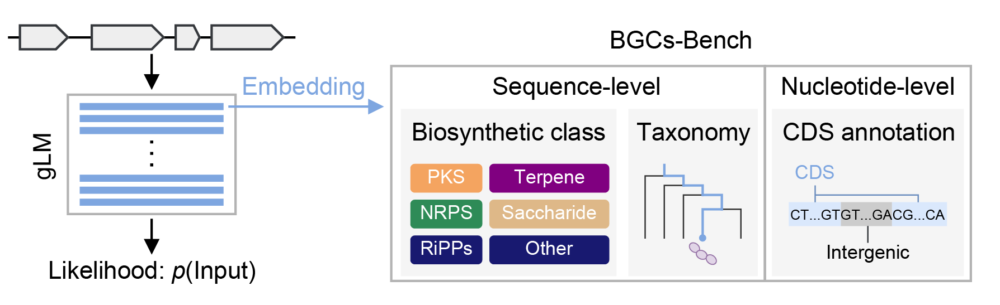

# BGCs-Bench

[](https://github.com/username/repo/blob/main/LICENSE)



BGCs-Bench is a unified benchmark focused on biosynthetic gene clusters (BGCs) for assessing long-sequence modeling and covers three complementary downstream tasks: biosynthetic class prediction, taxonomic classification, and CDS annotation.

Benchmarked models are below:
- HyenaDNA
- Evo
- Evo 2 (7B and 40B)
- NTv3

## Setup
All inference and analysis workflows (e.g., linear probing and logit lens) were executed using Apptainer.
```
# Evo 2
apptainer build containers/evo2_env.sif containers/evo2_env.def

# Other models and analyses
apptainer build containers/hf_env.sif containers/hf_env.def

# Prepare BGCs-Bench datasets.
unzip data.zip
```

## Minimal usage
### Run inference
The following code embeds BGC sequences in the 66k dataset using Evo 2 7B and produces representation vectors through mean-pooling and last-token aggregation.
```
python scripts/inference/evo2_inference.py \
    --input-fasta-list data/bgcsbench_sequence_66k.fasta \
    --output-dir embedding/66k \
    --model evo2_7b \
    --layer-names blocks.{0..31} \
    --mean-pooling \
    --last-token
```
### Linear probing
The following code trains and evaluates logistic regression classifiers for biosynthetic class prediction on the 66k dataset using Evo 2 7B embedding representations under cross-validation.
```
python scripts/probing/bgc_classification.py \
    --emb-dir embedding/66k/evo2_7b \
    --metadata data/bgcsbench_metadata_66k.tsv \
    --dataset-name 66k \
    --methods mean_pooling last_token \
    --layer-names blocks{0..31} \
    --output-file output/66k/evo2_7b/bgc_classification.tsv \
    --model-dir probe/66k/evo2_7b \
    --max-iter 1000
```
### Logit lens
The following code runs logit lens analysis on Evo 2 7B with the 66k dataset sequences.
```
python scripts/logitlens/evo2_logitlens.py \
    --input-fasta-list data/bgcsbench_sequence_66k.fasta \
    --output-dir logitlens \
    --model evo2_7b \
    --layer-names blocks.{0..31}
```

## Citation
> t.b.a
